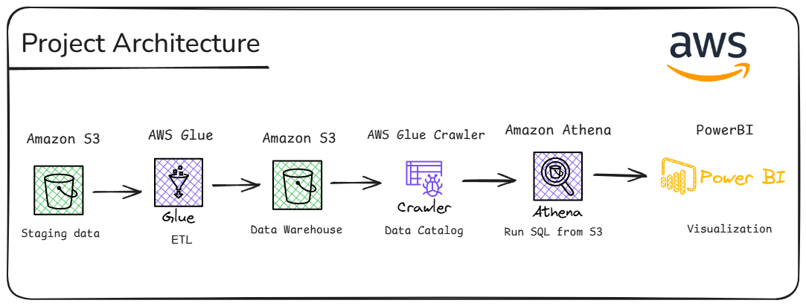

# Spotify ETL Data Pipeline on AWS



This project implements a **Modern Data Lakehouse** architecture in the cloud to process, store, and visualize large-scale data.


## 🚀 Key Features

- **Automated ETL Pipeline**  
  Automatic transformation of CSV data into compressed **Parquet** format using **Snappy** for storage efficiency and faster queries.

- **Unified Schema Catalog**  
  Uses **AWS Glue Crawler** for automatic data schema detection, enabling instant SQL queries without manual DDL management.


## 📟 Tech Stack
- **Storage:** AWS S3 (Staging & Data Lake)
- **ETL Engine:** AWS Glue (PySpark) for data cleaning and transformation
- **Analytics:** AWS Athena for SQL-based querying
- **Visualization:** PowerBI


## 🛠️ Technical Highlights

- **Data Normalization**  
  Performs complex joins across three main datasets:
  - Albums
  - Artists
  - Tracks

  This process is implemented using **PySpark** on **AWS Glue** to map performance metrics comprehensively.

- **Serverless Architecture**  
  The entire pipeline is built using a **serverless** approach, eliminating the need for manual server management and improving cost efficiency and scalability.


## ⚠️ Challenges & Solutions

### Challenge
Limited IAM access on the root account for running Glue Jobs.

### Solution
Implemented the **Least Privilege** principle by creating a dedicated IAM user and applying the appropriate **Role-based Access Control (RBAC)** for AWS Glue and S3.

---

## 📊 Impact / Result

- Successfully converted raw files into a columnar format (**Parquet**) that improves query performance up to **5x faster** compared to CSV.
- Produced an interactive analytics dashboard that helps stakeholders view music popularity trends by artist and album.

---

## 🔮 Future Improvements

- **Automation**  
  Integrate **AWS EventBridge** to trigger ETL jobs automatically whenever a new file is uploaded to S3.

- **Data Partitioning**  
  Add partitioning based on release year or genre for further query optimization.

---

## 📁 Architecture Summary

```text
Raw CSV Data
   ↓
Amazon S3 (Staging Layer)
   ↓
AWS Glue + PySpark (ETL & Transformation)
   ↓
Amazon S3 (Parquet Data Lake / Warehouse Layer)
   ↓
Amazon Athena (SQL Querying)
   ↓
Amazon QuickSight (Dashboard & Visualization)